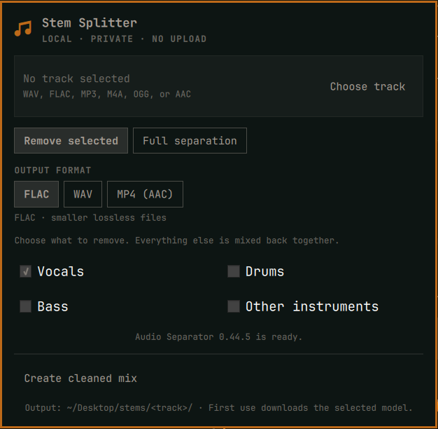

# Omarchy Stem Splitter

Remove selected parts from a song or split it into four high-quality stems directly from the Omarchy bar. Processing stays on your computer, and finished FLAC, WAV, or MP4 files are organized under `~/Desktop/stems/<track>/`.



Stem Splitter uses [Audio Separator](https://github.com/nomadkaraoke/python-audio-separator) with two deliberately chosen models:

- **BS-RoFormer** for the cleanest vocal-only removal
- **Fine-tuned HTDemucs** for full four-stem separation and multi-part removal

## Features

- Pick WAV, FLAC, MP3, M4A, OGG, AAC, WMA, or AIFF files from a native file dialog
- Remove vocals, drums, bass, other instruments, or any valid combination
- Preserve everything not selected by mixing the remaining stems back together
- Export each mix or stem as FLAC, 16-bit PCM WAV, or AAC audio in an MP4 container
- Save each result in its own non-overwriting Desktop subfolder
- Keep models and the pinned Python environment isolated from the system Python installation
- Stream useful progress and errors into the Omarchy panel
- Cancel without publishing partial results
- No account, API key, upload, telemetry, background service, or elevated permission

## Requirements

Install these standard Arch packages before setup:

- `uv` — creates the isolated Python 3.12 environment
- `ffmpeg` — reads, validates, and combines audio
- `zenity` — native audio-file picker

The plugin never invokes a system package manager or asks for elevated permission. Its explicit **Set up engine** action installs `torch==2.13.0+cpu` from PyTorch's official CPU wheel index, `audio-separator[cpu]==0.44.5`, `audioread==3.1.0`, and `librosa==0.10.2.post1` into `~/.local/share/omarchy-stem-splitter/venv` using `uv`.

## Install

Review the source, install the required packages, then add and enable the plugin:

```sh
omarchy pkg add uv ffmpeg zenity
omarchy plugin add https://github.com/dlpwaters/omarchy-stem-splitter.git --enable
```

Click the music-stem icon and choose **Set up engine**. The setup is user-local and requires network access once to download Python packages. The first run of each separation model also downloads that model into `~/.local/share/omarchy-stem-splitter/models`.

## Use

1. Open Stem Splitter from the bar and choose an audio track.
2. Select **Remove selected** and mark the parts to remove, or select **Full separation**.
3. Choose **FLAC**, **WAV**, or **MP4 (AAC)** as the output format.
4. Start processing and leave the panel open or close it while the job continues.
5. Open the finished folder from the panel or browse `~/Desktop/stems`.

Vocal-only removal automatically uses BS-RoFormer. Full separation and all other removal combinations use fine-tuned HTDemucs. The four standard stems are vocals, drums, bass, and `other`, where `other` contains the remaining instruments.

If a track folder already exists, Stem Splitter creates a numbered sibling such as `Track-2` instead of overwriting files.

### IPC

```sh
omarchy-shell io.github.dlpwaters.stem-splitter open
omarchy-shell io.github.dlpwaters.stem-splitter toggle
omarchy-shell io.github.dlpwaters.stem-splitter process "/path/to/song.flac" remove "vocals,drums"
omarchy-shell io.github.dlpwaters.stem-splitter processAs "/path/to/song.flac" full "vocals" wav
```

The original `process` IPC method always exports FLAC for backward compatibility. Use `processAs` with `flac`, `wav`, or `mp4` to select a format.

## Output

Removal mode produces one lossless file named for the removed parts, for example:

```text
~/Desktop/stems/Track/mix-without-vocals.flac
~/Desktop/stems/Track-2/mix-without-vocals-drums.wav
~/Desktop/stems/Track-3/mix-without-drums.mp4
```

Full separation produces:

```text
~/Desktop/stems/Track/
├── bass.wav
├── drums.wav
├── other.wav
├── vocals.wav
└── separation.json
```

`separation.json` records the engine, model, mode, output format, source filename, and creation time used for that result.

### Format compatibility

- **FLAC** is lossless and compact. It is the default and is ideal for archiving or further processing in modern audio software.
- **WAV** uses uncompressed 16-bit PCM at 44.1 kHz for maximum compatibility with editors, samplers, DAWs, and older software.
- **MP4 (AAC)** uses 256 kbps AAC-LC at 44.1 kHz in a standard `.mp4` container with fast-start metadata. It is compact and widely playable, but it is lossy.

## Privacy, network, and permissions

Audio processing is entirely local. The plugin never uploads track contents or reads credentials. Network access occurs only when `uv` installs the pinned open-source engine and when Audio Separator downloads a selected model for the first time.

Omarchy plugins run unsandboxed with the current user's permissions. This plugin limits its persistent writes to:

- `~/.local/share/omarchy-stem-splitter` — isolated engine and models
- `~/.cache/omarchy-stem-splitter` — temporary job staging, removed after each job
- `~/.local/state/omarchy-stem-splitter` — lock and last engine error
- `~/Desktop/stems` — finished user output

The source models may have licenses or usage conditions separate from this plugin. Audio Separator downloads them from its configured upstream sources; this repository does not redistribute model weights.

## Update

```sh
omarchy plugin update io.github.dlpwaters.stem-splitter --yes
```

## Remove

Remove the plugin checkout safely:

```sh
omarchy plugin remove io.github.dlpwaters.stem-splitter --yes
```

Removal intentionally preserves generated stems, downloaded models, and the isolated engine. If you also want to discard the engine and models, review the path and move it to Trash explicitly:

```sh
gio trash "$HOME/.local/share/omarchy-stem-splitter"
```

Generated files under `~/Desktop/stems` are never deleted automatically.

## Validate

```sh
./scripts/validate.sh
```

The validation script checks the manifest, compiles the Python helpers, runs unit tests, validates the Omarchy plugin when Omarchy is present, and runs `qmllint` against the installed shell when available.

## Quality notes

Source separation is an estimate, not access to the original studio multitracks. Dense mixes, heavy limiting, reverb, and lossy source files can produce bleed or artifacts. Start with a lossless source whenever possible. Choose FLAC or WAV when the result will be edited again; MP4 adds AAC compression and is intended for convenient playback or sharing.

## License

MIT. See [LICENSE](LICENSE). Audio Separator is separately distributed under the MIT license.
